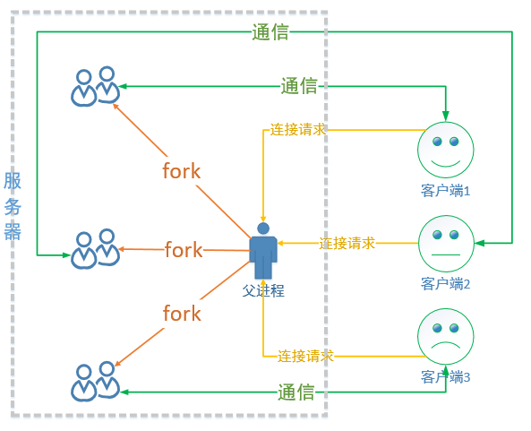

# TinyHttpdcpp

[Tiny HTTPd](https://sourceforge.net/projects/tinyhttpd/) implemented by C++

~~虽然说是用C++实现，但很多方法也没有C++风格的库函数，所以，可能就面向对象的思想吧~~

## 版本

用不同的分支存储不同的版本，

#### v_0.1

最初版本，简单的B/S通信模型，

服务端支持连接多个客户端，但是由于没有设置多线程，只能依次响应请求，每次和客户端通信一次就会关闭。

#### v_0.2

在第一版的基础上增加了持续连接，客户端可以持续发送多条信息。

#### v_0.3

实现多线程并发，可以同时和多个客户端通信。

- 主线程：
  - 负责监听，处理客户端的连接请求，也就是在父进程中循环调用 accept() 函数
  - 创建子线程：建立一个新的连接，就创建一个新的子进程，让这个子进程和对应的客户端通信
  - 回收子线程资源：由于回收需要调用阻塞函数，这样就会影响 accept()，直接做线程分离即可。
- 子线程：负责通信，基于主线程建立新连接之后得到的文件描述符，和对应的客户端完成数据的接收和发送。
  - 发送数据：send() / write()
  - 接收数据：recv() / read()

不同线程的栈空间(临时变量)是独占的，但是共享全局的数据区、堆区、以及内核区的文件描述符，因此需要注意 *文件覆盖*， 在多线程访问共享资源时需要进行 *线程同步*。


#### v_0.4

多进程版TCP服务端

在 Tcp 服务器端一共有两个角色，分别是：监听和通信，监听是一个持续的动作，如果有新连接就建立连接，如果没有新连接就阻塞。关于通信是需要和多个客户端同时进行的，因此需要多个进程，这样才能达到互不影响的效果。进程也有两大类：父进程和子进程，通过分析我们可以这样分配进程：

- 父进程：
  - 负责监听，处理客户端的连接请求，也就是在父进程中循环调用 accept() 函数
  - 创建子进程：建立一个新的连接，就创建一个新的子进程，让这个子进程和对应的客户端通信
  - 回收子进程资源：子进程退出回收其内核 PCB 资源，防止出现僵尸进程
- 子进程：
  - 负责通信，基于父进程建立新连接之后得到的文件描述符，和对应的客户端完成数据的接收和发送。
  - 发送数据：send() / write()
  - 接收数据：recv() / read()


- 子进程是父进程的拷贝，在子进程的内核区 PCB 中，文件描述符也是可以被拷贝的，因此在父进程可以使用的文件描述符在子进程中也有一份，并且可以使用它们做和父进程一样的事情。

- 父子进程有用各自的独立的虚拟地址空间，因此所有的资源都是独占的

- 为了节省系统资源，对于只有在父进程才能用到的资源，可以在子进程中将其释放掉，父进程亦如此。

- 由于需要在父进程中做 accept() 操作，并且要释放子进程资源，如果想要更高效一下可以使用信号的方式处理



#### v_0.5

使用C++的线程类优化v_0.3的代码

```cpp
#include <thread>
// 构造函数
explicit thread( Function&& f, Args&&... args );
// 得到线程ID
thread t1(func1);
t1.get_id();
// 可以使用this_thread命名空间得到当前线程的ID
this_thread::get_id();
// 等待线程结束
t1.join();
// 分离线程，自行释放资源
t1.detach();

```

#### v_0.6

线程池版服务器，顺便增加了makefile文件，线程池的实现在[这里](https://github.com/lepecoder/threadpool).


#### v_0.7

参考`tinyhttpd`实现web服务


