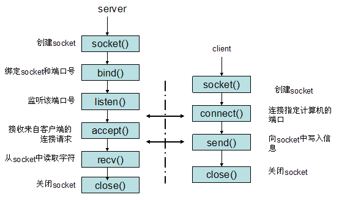

# tinyhttpdcpp

## 前置知识

### CGI脚本

Common Gateway Interface，不是一门编程语言，是网页表单与程序之间的通信协议，可以用任何语言编写CGI脚本。

**工作流程**

1. 读取用于提交的表单信息
2. 处理信息
3. 输出，返回html响应内容


**intptr_t**: 

int相关的类型在不同位数机器的平台下长度不同，使用int时也可以使用intptr_t来保证平台的通用性，它在不同的平台上编译时长度不同，但都是标准的平台字长。比如64位机器它的长度就是8字节，32位机器它的长度是4字节，使用它可以安全地进行整数与指针的转换运算，也就是说当需要将指针作为整数运算时，将它转换成intptr_t进行运算才是安全的。

将指针转换为`intptr_t`类型，再赋值给int比较安全，可以将`intptr_t`看做合适长度的int类型。


### socket编程

网络上的两个程序通过一个双向的通信连接实现数据的交换，这个连接的一端称为一个socket。

服务器和客户端用socket通信的过程



#### 服务端

**1. 建立套接字对象**

```cpp
/*
* _domain 套接字使用的协议族信息
* _type 套接字的传输类型
* __protocol 通信协议
*/
int socket(int __domain, int __type, int __protocol) __THROW;
```

|  协议族  |                    含义                    |
| :------: | :----------------------------------------: |
| AF_INET  |         IPv4网络协议中采用的地址族         |
| AF_INET6 |         IPv6网络协议中采用的地址族         |
| AF_LOCAL | 本地通信中采用的UNIX协议的地址族（用的少） |

| 套接字传输类型 |                             含义                             |
| :------------: | :----------------------------------------------------------: |
|   SOCKET_RAW   | 原始套接字(SOCKET_RAW)允许对较低层次的协议直接访问，比如IP、 ICMP协议。 |
|  SOCK_STREAM   |        SOCK_STREAM是数据流，一般为TCP/IP协议的编程。         |
|   SOCK_DGRAM   |        SOCK_DGRAM是数据报，一般为UDP协议的网络编程；         |

*通信协议：*

常见的协议有IPPROTO_TCP、IPPTOTO_UDP。如果第二个参数选择了SOCK_STREAM，那么采用的协议就只能是IPPROTO_TCP；如果第二个参数选择的是SOCK_DGRAM，则采用的协议就只能是IPPTOTO_UDP。


**2. 向套接字分配网络地址**

```cpp
/* 
* __fd:socket描述字，也就是socket引用
* myaddr:要绑定给sockfd的协议地址
* __len:地址的长度
*/
int bind (int __fd, const struct sockaddr* myaddr, socklen_t __len)  __THROW;
```

`__fd`是创建套接字时返回的对象，`myaddr`是网络地址信息

```cpp
struct sockaddr_in{
    sa_family_t sin_family;		//前面介绍的地址族
    uint16_t sin_port;			//16位的TCP/UDP端口号
    struct in_addr sin_addr;	//32位的IP地址
    char sin_zero[8];			//不使用
}
```


**3. 等待连接请求**

给套接字分配所需信息之后，可以使用`listen()`监听客户端的连接请求，

```cpp
/* Prepare to accept connections on socket FD.
   N connection requests will be queued before further requests are refused.
   Returns 0 on success, -1 for errors.  */
extern int listen (int __fd, int __n) __THROW;
```


**4. 处理客户端连接请求**

在套接字`listen()`之后，客户端通过`connect()`发出连接，之前监听的套接字类似门卫，需要创建另外的套接字与客户端交互。


**5. send/write发送信息**

linux下发送函数

```cpp
/* Write N bytes of BUF to FD.  Return the number written, or -1.
This function is a cancellation point and therefore not marked with __THROW.  */
 ssize_t write (int __fd, const void *__buf, size_t __n) ;
```

**6. recv/read接收信息**

Linux下接收函数

```cpp
/* Read NBYTES into BUF from FD.  Return the
   number read, -1 for errors or 0 for EOF.

   This function is a cancellation point and therefore not marked with
   __THROW.  */
ssize_t read (int __fd, void *__buf, size_t __nbytes);
```

**7. 关闭连接**

```cpp
/* Close the file descriptor FD.

   This function is a cancellation point and therefore not marked with
   __THROW.  */
int close (int __fd);  // 类似发送了EOF结束标志
```


客户端通过相似的方式创建连接，并通过`connect()`与服务端通信。

### 字节序

数据在内存中都是小端序存储，而在网络传输时都是大端序，而我们习惯的IP地址又是点分十进制，这样就会有一系列的转换函数。

```cpp
// 将char类型的IP地址转换为二进制
int inet_aton(const char *__cp, struct in_addr *__inp);
/*
h代表主机字节序
n代表网络字节序
s代表short(4字节)
l代表long(8字节)
*/
// network to host long
uint32_t ntohl (uint32_t __netlong); 
// network to host short
uint16_t ntohs (uint16_t __netshort);
// host to network long
uint32_t htonl (uint32_t __hostlong);
// host to network short
uint16_t htons (uint16_t __hostshort);
```


